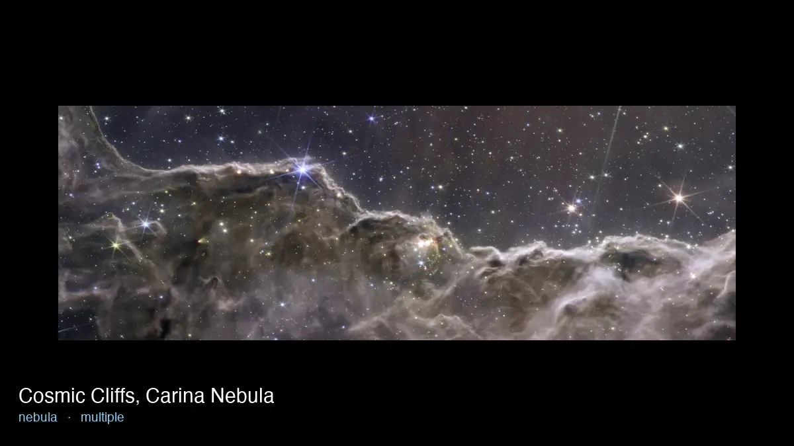

# JWST Image Pipeline

An Airflow pipeline that turns the NASA Webb Telescope's Flickr archive into a
labelled dataset of real astronomical observations. Most of the account's 4,000+
photos are hardware, events and artwork. The pipeline separates out the observations
and labels each one by subject, modality, object and instrument.

**Output:** [481 labelled observations](include/data/dataset), plus the 596 rejected
photos, each with a reason.



*Nine rows from the dataset, captioned with the subject and instrument the pipeline
assigned. Generated by [`scripts/build_gallery.py`](scripts/build_gallery.py) from the
published data. Images: NASA, ESA, CSA, STScI.*

## Why

An earlier version,
[jwst-flickr-classifier](https://github.com/RK-A1/jwst-flickr-classifier), labelled
photos from their Flickr tags. Flickr strips the spaces out of tags, so rules like
`star cluster` never matched. Globular clusters became `star`, planetary nebulae became
`exoplanet`, and no photo was ever labelled `black_hole`.

This pipeline has Claude Haiku 4.5 label each photo from its caption and image instead,
against the definitions in [`codebook.md`](docs/codebook.md). The image matters: one
Sagittarius A* caption describes real Webb observing time, but the picture itself is
marked "Artist's Concept".

## Pipeline

```
                    ┌─────────────┐  photos   ┌────────────┐  embeddings
  Flickr API ──────▶│ jwst_ingest │──────────▶│ jwst_embed │─────────────┐
     @daily         └─────────────┘           └────────────┘             ▼
                                                                  ┌──────────────┐
                    ┌─────────────┐  label log                    │ jwst_dataset │──▶ dataset/
  Claude API ──────▶│ jwst_label  │──────────────────────────────▶│ write·audit· │
     manual         └─────────────┘                               │   publish    │
                                                                  └──────────────┘
```

| DAG | Trigger | Does |
|---|---|---|
| `jwst_ingest` | daily | Finds new photos by id, fetches captions, downloads originals |
| `jwst_embed` | new photos | ResNet50 embeddings in parallel mapped tasks, loaded by one writer |
| `jwst_label` | manual | Labels new photos with Claude, capped per run |
| `jwst_dataset` | new labels or embeddings | Builds, audits and publishes the dataset |

The DAGs trigger each other through Airflow assets, and emit them only when data
actually changed.

## Engineering highlights

- **Incremental and state-driven.** Each stage plans its work from what the DuckDB
  warehouse is missing, so a failure today is retried tomorrow. New photos are found by
  id, not date: Flickr dates the Horsehead Nebula to 2124.
- **Single-writer DuckDB.** Every task that opens the warehouse runs in a one-slot pool.
  Network calls run in separate tasks, so none holds the pool while waiting. A test
  enforces both.
- **Write-audit-publish.** The dataset is built in staging and only replaces the
  published files if the build passes checks: unique keys, valid codebook values, one
  primary image per release, every label accounted for, and no unexpected drop in rows.
- **Spend control.** Labelling costs about half a cent a photo, so it is manual and
  capped per run. Every response goes to an append-only log committed to git, so an
  interrupted run never pays twice. A fresh clone rebuilds the dataset without
  relabelling.
- **Verified downloads.** Files are length-checked and fully decoded before being moved
  into place. The old ingest had left nine truncated images it would never refetch.
- **No secrets in logs.** Flickr's API key travels in the URL, so client errors are
  redacted before Airflow can log them.
- **Airflow at the edges.** DAGs handle only ordering, retries and concurrency. All
  logic is plain Python in `include/jwst_pipeline/`, tested without a scheduler.

## Running it

Requires the [Astro CLI](https://www.astronomer.io/docs/astro/cli/install-cli), Docker
and a Flickr API key. Labelling also needs an Anthropic API key.

```bash
cp .env.example .env     # FLICKR_API_KEY, plus ANTHROPIC_API_KEY for labelling
astro dev start          # Airflow UI at http://localhost:8080
astro dev pytest         # run the tests (host alternative: pip install -e ".[dev]")
```

Unpause `jwst_ingest`, `jwst_embed` and `jwst_dataset`, then label when there is
something to label:

```bash
astro dev run dags trigger jwst_label --conf '{"max_photos": 50}'
```

## The dataset

`include/data/dataset/` holds `jwst_space_images.parquet` (and `.csv`), the rejected
photos in `rejected.parquet` (and `.csv`), and a `manifest.json` of counts and checksums.

| Field | Meaning |
|---|---|
| `subject` | One of 13 classes, from `galaxy` to `black_hole`, defined in `docs/codebook.md` |
| `modality` | `image`, `annotated_image`, `spectrum_or_plot` or `comparison_composite` |
| `object_name`, `object_name_normalized` | Catalogue name as written, and in canonical form (`M51` = `Messier 51`) |
| `instrument` | NIRCam, MIRI, NIRSpec, NIRISS, FGS, multiple, non-Webb or unknown |
| `release_group`, `is_primary` | Renderings of one press figure, and its representative |
| `near_duplicate_group` | Images whose embeddings exceed 0.95 cosine similarity |

Each row also carries the caption, Flickr metadata, the model's rationale, and its
provenance.

## Limitations

- **Labels are unverified.** They are model-generated and not yet hand-checked. Each
  build writes a review sheet for that purpose.
- **`confidence` is always `high`**, so it cannot flag uncertain rows.
- **`instrument` is the weakest field.** `multiple` is corrected from the caption text,
  but 11 rows still name an instrument their caption never mentions.
- **`subject` is single-label**, and `date_taken` is Flickr's, unmodified.
- **Early-dated photos are skipped.** Photos dated before launch are not labelled, so an
  observation with a wrong early date would be missed.
- **Press images, not science data.** They suit classification and similarity work, but
  not photometry.

## Layout

```
dags/                    orchestration: order, retries, pools, assets
include/jwst_pipeline/   Flickr client, warehouse, embeddings, labelling, dataset build, checks
include/data/dataset/    the published dataset (tracked)
include/data/labels/     every model response (tracked)
scripts/                 legacy migration, label-run comparison, README gallery
tests/                   unit, integration and DAG structure tests
docs/codebook.md         the label definitions the model is prompted with
docs/NEXT.md             current state and open work
docs/images/             the README gallery
```
